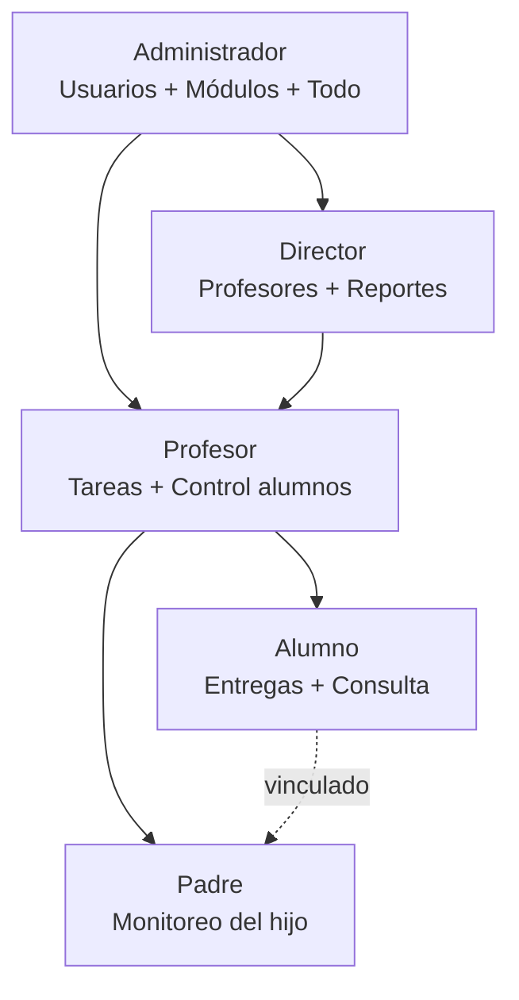
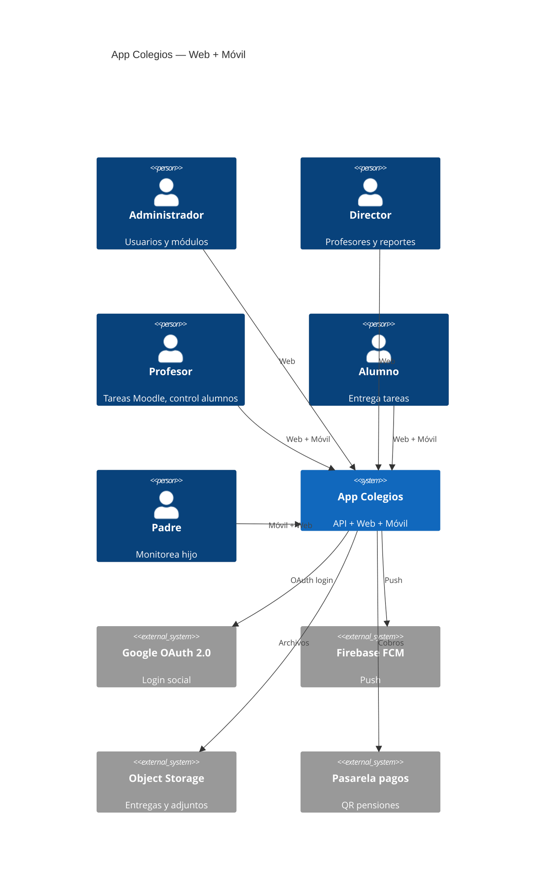
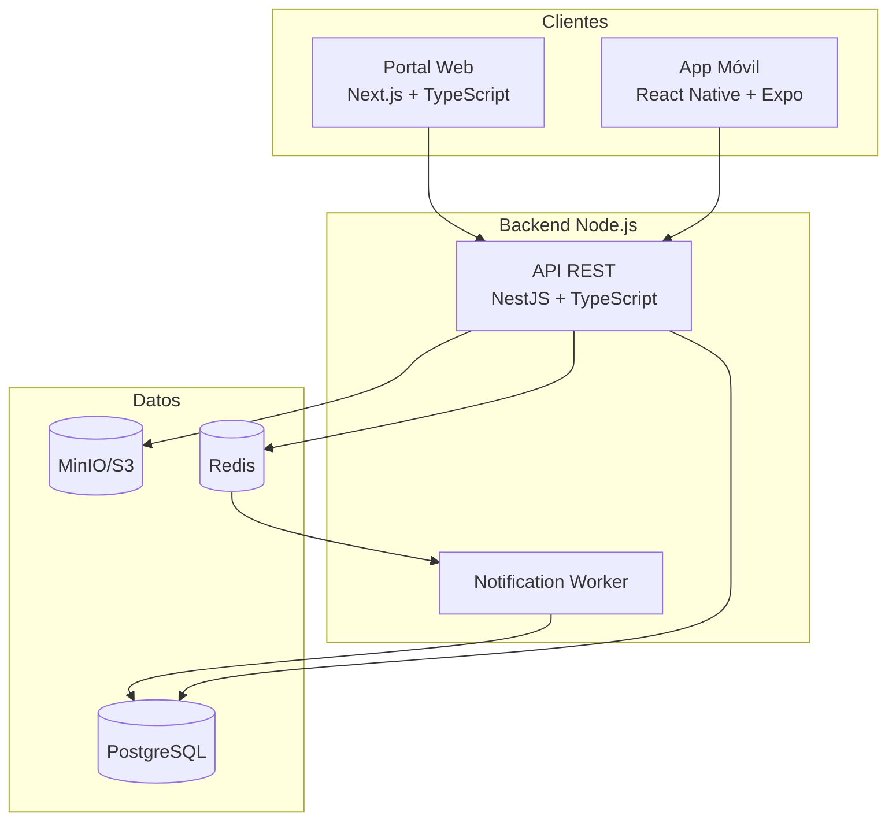
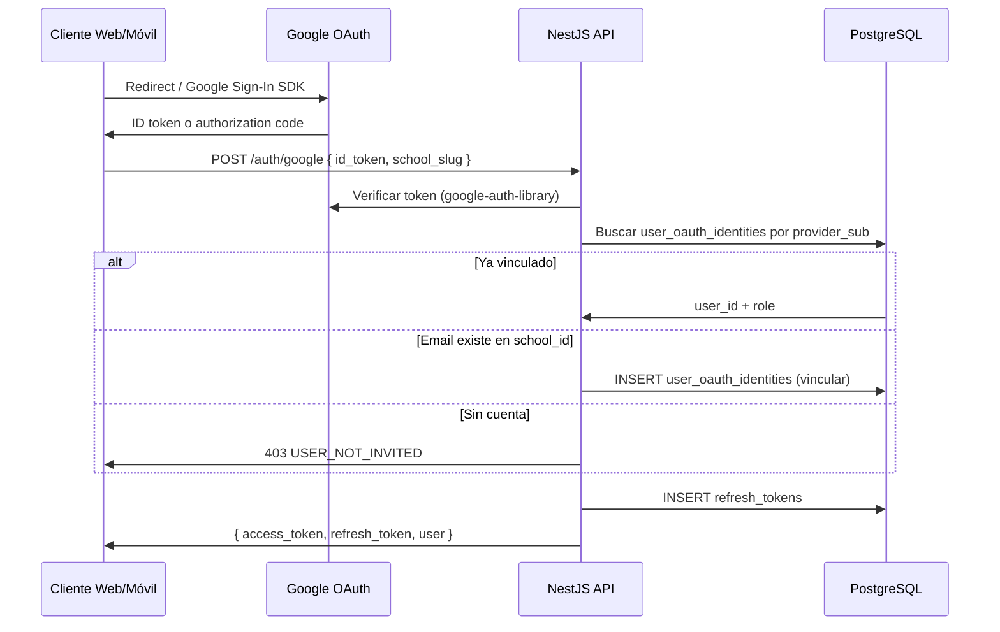
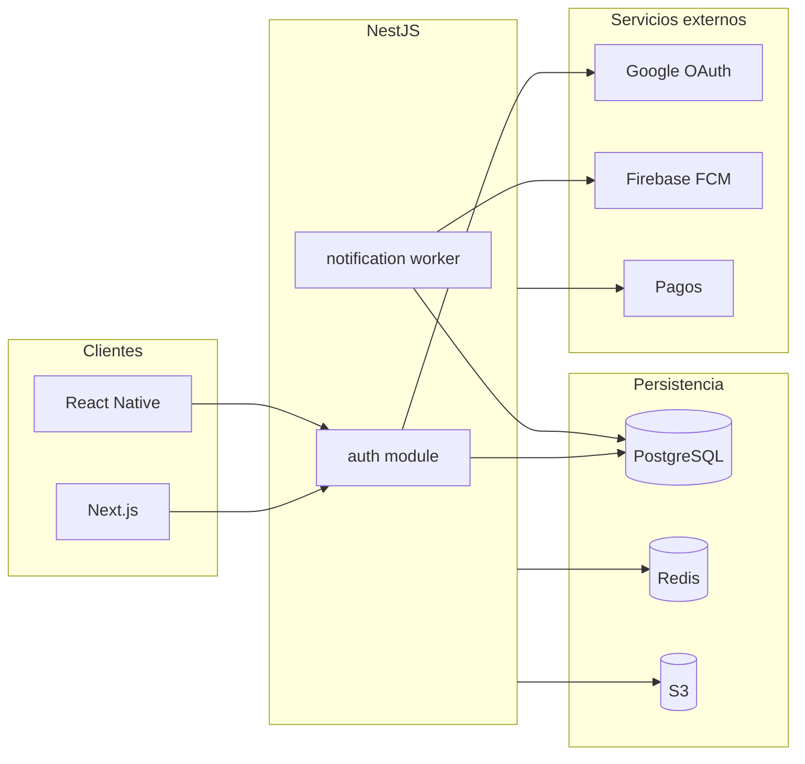

# Architecture — Aplicación de Colegios

## 1. Visión del producto

Plataforma **web + móvil** centrada en:

1. **Control del alumno por padres de familia** — dashboard unificado (asistencia, tareas, notas, disciplina).
2. **Gestión de tareas estilo [Moodle](https://moodle.org/)** — publicar, entregar, calificar, feedback.
3. **Jerarquía escolar clara** — Administrador → Director → Profesor → Alumno/Padre.

### Clientes oficiales

| Cliente | Stack | Roles |
|---------|-------|-------|
| **Portal Web** | Next.js 14 + TypeScript | Admin, Director, Profesor, Padre, Alumno |
| **App Móvil** | React Native + TypeScript (Expo) | Profesor, Padre, Alumno |

> Una sola **API REST** (`Openapi.yml`) sirve a web y móvil. TypeScript en las tres capas (backend, web, móvil).

### Distribución web vs móvil por rol

| Rol | Web | Móvil | Razón |
|-----|:---:|:-----:|-------|
| Administrador | ✓ | — | Gestión compleja; solo escritorio |
| Director | ✓ | — | Reportes, tablas, export PDF |
| Profesor | ✓ | ✓ | Web: panel entregas; móvil: asistencia rápida en aula |
| Alumno | ✓ | ✓ | Móvil: entregar tareas con cámara; web: vista cómoda |
| Padre | ✓ | ✓ | **Móvil principal** — push y monitoreo diario |

---

## 2. Jerarquía de roles



| Rol | Código | Acceso |
|-----|--------|--------|
| Administrador | `admin` | Total del tenant |
| Director | `director` | Profesores, reportes, comunicados |
| Profesor | `teacher` | Sus cursos: tareas, asistencia, disciplina, calificaciones |
| Alumno | `student` | Propio: tareas, entregas, asistencia, notas |
| Padre | `parent` | Hijo(s) vinculados: monitoreo, sin entregas |

---

## 3. Principios arquitectónicos

1. **SDD:** User stories Gherkin → Models → Database → OpenAPI → código.
2. **Multi-tenant:** Aislamiento por `school_id`.
3. **API-first, multi-cliente:** Next.js (web) + React Native (móvil) → misma API NestJS.
4. **TypeScript end-to-end:** Tipos generados desde `Openapi.yml` compartidos en web y móvil.
5. **LMS módulo central:** Tareas con ciclo Moodle (publish → submit → grade → notify).
6. **RBAC estricto:** Middleware de rol + ownership (padre→hijo, profesor→curso).
7. **Event-driven:** Notificaciones push/email vía cola async.
8. **PostgreSQL como fuente de verdad:** Integraciones externas (Google, FCM) son servicios; solo referencias/tokens en BD.
9. **Clean code & SOLID:** Ver `DevelopmentPrinciples.md` — KISS, DRY, YAGNI en todo el monorepo.

---

## 4. Diagrama de contexto



---

## 5. Diagrama de contenedores



---

## 6. Módulo LMS (estilo Moodle)

```
assignments/
├── create          # Profesor publica tarea (US-003)
├── list            # Alumno/padre/profesor listan
├── submissions/
│   ├── submit      # Alumno entrega (US-025)
│   ├── grade       # Profesor califica (US-026)
│   └── panel       # Panel entregas (US-027)
└── notifications   # Push a alumno y padre
```

### Estados de entrega (Submission)

```
pendiente → entregada | entregada_tarde → calificada
                                      ↘ devuelta (rehacer)
```

---

## 7. Módulos de dominio

```
src/
├── auth/              # US-020 Login local + Google OAuth
│   ├── local/         # email/password
│   ├── google/        # OAuth 2.0 callback, link account
│   └── jwt/           # tokens + refresh
├── admin/             # US-022 Usuarios y módulos
├── director/          # US-023, US-024 Profesores y reportes
├── users/
├── students/
├── guardians/         # US-021 Vinculación padre-alumno
├── assignments/       # US-003–028 LMS Moodle
├── submissions/       # Entregas de alumnos
├── parent-dashboard/  # US-029 Panel control parental
├── attendance/        # US-001, US-002
├── discipline/        # US-005, US-006
├── grades/            # US-013
├── announcements/
├── signatures/
└── notifications/
```

---

## 8. Stack tecnológico oficial

| Capa | Tecnología | Notas |
|------|------------|-------|
| **Backend** | Node.js + **NestJS** + TypeScript | API REST, RBAC, multi-tenant |
| **Web** | **Next.js 14** (App Router) + TypeScript | Un portal con layouts por rol |
| **Móvil** | **React Native** + TypeScript + **Expo** | iOS + Android, un codebase |
| **BD principal** | **PostgreSQL 16** | Datos transaccionales, OAuth identities, LMS |
| Cache/Colas | Redis + BullMQ | Notificaciones async, rate limit |
| Storage | MinIO / S3 | Entregas, adjuntos, firmas |
| Auth local | JWT + refresh token | Tabla `refresh_tokens` en PostgreSQL |
| Auth social | **Google OAuth 2.0** | `@nestjs/passport` + `google-auth-library` |
| Push | Firebase FCM | Token en `users.fcm_token` |
| API Spec | OpenAPI 3.1 | Generación de cliente con `openapi-typescript` |
| Monorepo (opcional) | Turborepo o pnpm workspaces | `apps/api`, `apps/web`, `apps/mobile`, `packages/shared` |

### Por qué PostgreSQL (decisión registrada)

- Dominio **relacional**: colegios, cursos, alumnos, tareas, entregas, asistencia.
- **Multi-tenant** con `school_id` y Row-Level Security.
- **Reportes** del director con SQL (JOINs, agregaciones).
- **Integraciones externas** (Google, FCM, pagos) no reemplazan la BD; guardan referencias en PostgreSQL.
- Alternativas descartadas para BD principal: MongoDB (peor integridad/reportes), Firestore (no apto para ERP escolar).

**Complementos:** Redis (no reemplaza PostgreSQL), S3 (archivos binarios).

### Por qué React Native (decisión registrada)

- Un solo codebase para Android e iOS.
- Mismo lenguaje (TypeScript) que NestJS y Next.js.
- Funcionalidades clave cubiertas: push, cámara, adjuntos, firma en canvas.
- MVP más rápido que Kotlin + Swift por separado.

### Estructura de repositorio propuesta

```
colegio/
├── apps/
│   ├── api/                 # NestJS (Node.js)
│   ├── web/                 # Next.js — portal único, rutas por rol
│   └── mobile/              # React Native + Expo
├── packages/
│   ├── shared/              # Tipos, validadores, constantes
│   └── api-client/          # Cliente generado desde Openapi.yml
└── specs/                   # SDD (este proyecto)
```

### Web — Next.js: layouts por rol

```
app/
├── (auth)/login/
├── (admin)/          # Solo rol admin
│   ├── users/
│   └── modules/
├── (director)/       # Solo rol director
│   ├── teachers/
│   └── reports/
├── (teacher)/        # Rol teacher
│   ├── assignments/
│   ├── submissions/  # Panel entregas Moodle
│   └── attendance/
└── (family)/         # Padre + alumno
    ├── dashboard/    # Panel control (padre)
    ├── assignments/  # Lista y detalle tareas
    └── submit/       # Entrega (alumno)
```

### Móvil — React Native: navegación por rol

Tras login, redirigir según `user.role`:

```
MobileNavigator
├── TeacherStack     # Profesor
├── StudentStack     # Alumno
└── ParentStack      # Padre
```

Admin y director **no tienen app móvil** — se les muestra mensaje para usar el portal web.

---

## 9. Matriz de pantallas por rol y plataforma

Leyenda: **W** = Web (Next.js) · **M** = Móvil (React Native) · **—** = no disponible

### Administrador (solo Web)

| Pantalla | W | M | User Story |
|----------|:-:|:-:|------------|
| Login | ✓ | — | US-020 |
| Gestión de usuarios (CRUD) | ✓ | — | US-022 |
| Activar/desactivar módulos | ✓ | — | US-022 |
| Vincular padre ↔ alumno | ✓ | — | US-021 |
| Configuración del colegio | ✓ | — | US-022 |
| Vista de todos los módulos | ✓ | — | — |

### Director (solo Web)

| Pantalla | W | M | User Story |
|----------|:-:|:-:|------------|
| Login | ✓ | — | US-020 |
| Listado de profesores | ✓ | — | US-023 |
| Asignar profesor → curso/materia | ✓ | — | US-023 |
| Reportes por profesor | ✓ | — | US-024 |
| Exportar reporte PDF | ✓ | — | US-024 |
| Comunicados oficiales | ✓ | — | US-007 |
| Dashboard resumen colegio | ✓ | — | — |

### Profesor (Web + Móvil)

| Pantalla | W | M | User Story | Notas |
|----------|:-:|:-:|------------|-------|
| Login | ✓ | ✓ | US-020 | |
| Publicar tarea (Moodle) | ✓ | ✓ | US-003 | Web: formulario completo; móvil: versión simplificada |
| Panel de entregas | ✓ | M* | US-027 | *Móvil: resumen; web: tabla completa |
| Calificar entrega + feedback | ✓ | ✓ | US-026 | |
| Marcar asistencia | ✓ | ✓ | US-001 | **Móvil prioritario** en aula |
| Historial asistencia curso | ✓ | — | US-002 | |
| Cuaderno disciplina | ✓ | ✓ | US-005, US-006 | |
| Publicar calificaciones | ✓ | — | US-013 | |
| Solicitar firma digital | ✓ | ✓ | US-018 | |
| Chat con padres | — | ✓ | US-010 | Fase v1.2; móvil first |

### Alumno (Web + Móvil)

| Pantalla | W | M | User Story | Notas |
|----------|:-:|:-:|------------|-------|
| Login | ✓ | ✓ | US-020 | |
| Mis tareas (pendientes/entregadas/calificadas) | ✓ | ✓ | US-028 | |
| Detalle de tarea + instrucciones | ✓ | ✓ | US-028 | |
| **Entregar tarea** (archivo/foto) | ✓ | ✓ | US-025 | **Móvil prioritario** — cámara |
| Ver calificación y feedback | ✓ | ✓ | US-026 | |
| Mi asistencia | ✓ | ✓ | US-002 | |
| Mis calificaciones | ✓ | ✓ | US-013 | |
| Comunicados | ✓ | ✓ | US-008 | |
| Calendario escolar | ✓ | ✓ | US-009 | |

### Padre de familia (Web + Móvil)

| Pantalla | W | M | User Story | Notas |
|----------|:-:|:-:|------------|-------|
| Login | ✓ | ✓ | US-020 | |
| **Panel de control del hijo** | ✓ | ✓ | US-029 | **Móvil = pantalla principal** |
| Tareas del hijo (solo lectura) | ✓ | ✓ | US-004 | No puede entregar |
| Asistencia del hijo | ✓ | ✓ | US-002 | Push en móvil |
| Calificaciones del hijo | ✓ | ✓ | US-013 | |
| Disciplina del hijo | ✓ | ✓ | US-005 | |
| **Firma digital** (autorizaciones) | ✓ | ✓ | US-018, US-019 | Canvas táctil en móvil |
| Comunicados | ✓ | ✓ | US-008 | |
| Chat con profesor | — | ✓ | US-010 | Fase v1.2 |
| Pagos / QR pensión | ✓ | ✓ | US-012 | Fase v1.3 |

### Pantallas exclusivas de móvil

| Pantalla | Rol | Motivo |
|----------|-----|--------|
| Notificaciones push (centro) | Todos en móvil | FCM nativo |
| Marcar asistencia rápida en aula | Profesor | Uso en pie, sin laptop |
| Entregar tarea con cámara | Alumno | Foto directa del cuaderno |
| Firma en canvas táctil | Padre | Experiencia natural |
| Salida segura (check-out) | Profesor | Portería / salida del colegio |

### Pantallas exclusivas de web

| Pantalla | Rol | Motivo |
|----------|-----|--------|
| CRUD usuarios | Admin | Tablas complejas, muchos campos |
| Configuración módulos | Admin | Solo administración |
| Reportes director + export PDF | Director | Pantalla grande, impresión |
| Panel entregas completo (tabla 30+ alumnos) | Profesor | Calificar legacy desktop |
| Asignación masiva profesor-curso | Director | Gestión batch |

---

## 10. Código compartido (packages/shared)

Tipos y utilidades reutilizables entre web, móvil y API:

```typescript
// packages/shared/src/roles.ts
export const ROLES = ['admin', 'director', 'teacher', 'student', 'parent'] as const;

// packages/shared/src/submission-status.ts
export type SubmissionStatus = 'pendiente' | 'entregada' | 'entregada_tarde' | 'calificada' | 'devuelta';

// packages/api-client — generado desde specs/Openapi.yml
```

Generar cliente:

```bash
npx openapi-typescript specs/Openapi.yml -o packages/api-client/src/schema.ts
```

---

## 11. Seguridad RBAC

| Endpoint pattern | admin | director | teacher | student | parent |
|-----------------|:-----:|:--------:|:-------:|:-------:|:------:|
| `/admin/*` | ✓ | — | — | — | — |
| `/director/*` | ✓ | ✓ | — | — | — |
| `/assignments POST` | ✓ | — | ✓* | — | — |
| `/submissions POST` | — | — | — | ✓* | — |
| `/parents/dashboard/*` | ✓ | — | — | — | ✓* |
| `/students/{id}/*` | ✓ | ✓ | ✓* | ✓† | ✓‡ |

\* Solo recursos propios/asignados  
† Solo `{id}` = propio  
‡ Solo `{id}` = hijo vinculado

\* Solo `{id}` = hijo vinculado

---

## 12. Autenticación: local + Google OAuth

### Modelo híbrido

| Método | Quién lo usa | Almacenamiento |
|--------|--------------|----------------|
| Email + contraseña | Todos (admin crea cuentas) | `users.password_hash` |
| Google OAuth | Padres, alumnos, profesores (opcional por colegio) | `user_oauth_identities` |

El **rol** (`admin`, `director`, etc.) lo asigna el colegio en PostgreSQL. Google solo provee identidad (email, nombre, `sub`).

### Flujo Google OAuth (web y móvil)



### Endpoints auth (planificados)

| Método | Ruta | Descripción |
|--------|------|-------------|
| POST | `/auth/login` | Email + password + `school_slug` |
| POST | `/auth/google` | Intercambiar Google ID token por JWT propio |
| POST | `/auth/refresh` | Renovar access token |
| POST | `/auth/logout` | Revocar refresh token |
| POST | `/auth/link/google` | Usuario logueado vincula Google |
| DELETE | `/auth/link/google` | Desvincular Google (requiere password local) |

### Variables de entorno (API)

```env
GOOGLE_CLIENT_ID=xxx.apps.googleusercontent.com
GOOGLE_CLIENT_SECRET=xxx                    # solo server-side
GOOGLE_CALLBACK_URL=https://api.../auth/google/callback
JWT_SECRET=xxx
JWT_REFRESH_SECRET=xxx
```

### Configuración por colegio

Admin activa Google en `schools.settings.auth`:

```json
{
  "auth": {
    "google_enabled": true,
    "local_login_enabled": true,
    "allowed_email_domains": ["sanmiguel.edu.bo"],
    "auto_link_by_email": true
  }
}
```

Si `allowed_email_domains` está definido, rechazar Google login con email fuera del dominio.

### Seguridad OAuth

- Validar `aud` (client_id) e `iss` (`accounts.google.com`) del ID token
- No confiar en email del cliente sin verificar token en servidor
- Rate limit en `/auth/google` (Redis)
- Registrar `last_login_at` en `users`

---

## 13. Integraciones externas

| Integración | Fase | Protocolo | Datos en PostgreSQL |
|-------------|------|-----------|---------------------|
| **Google OAuth 2.0** | MVP | OIDC / ID token | `user_oauth_identities`, `users` |
| **Firebase FCM** | MVP | HTTP API | `users.fcm_token` |
| **Email (SendGrid / Gmail API)** | v1.2 | SMTP / REST | cola en Redis; sin tabla propia MVP |
| **Google Drive** (opcional) | v2 | Google APIs | URL en `assignments.attachments` JSONB |
| **Pasarela pagos / QR** | v1.3 | REST banco/wallet | `payments.reference`, `qr_payload` |
| **Webhooks\*** (chat) | v1.2 | Socket.io | `messages`, `message_threads` |

\* Chat fase v1.2; MVP no requiere WebSocket.

### Diagrama integraciones



### Principio de integración

1. **PostgreSQL** = estado de negocio (usuarios, tareas, pagos pendientes).
2. **Servicio externo** = acción (enviar push, verificar OAuth, procesar pago).
3. **Redis** = cola/eventos; reintentos sin bloquear API.
4. **S3** = binarios; BD solo guarda URL/referencia.

---

## 14. Roadmap frontend

| Fase | Web (Next.js) | Móvil (React Native) |
|------|---------------|----------------------|
| **MVP** | Login, admin usuarios, profesor tareas+panel, padre dashboard, alumno entregas | Login padre/profesor/alumno, dashboard padre, entrega tareas, asistencia profesor, push |
| **v1.1** | Reportes director, calificaciones | Calificaciones, disciplina (consulta padre) |
| **v1.2** | Comunicados, chat web profesor | Chat, firma digital, comunicados |
| **v1.3** | Pagos, encuestas | Pagos QR, offline cache tareas |

---

## 15. Roadmap backend + producto

| Fase | Alcance | Stories |
|------|---------|---------|
| **MVP** | Auth local + **Google OAuth**, LMS, panel padre, asistencia, admin | US-020–029, US-001–006 |
| **v1.1** | Reportes director, calificaciones, disciplina avanzada | US-023–024, US-013 |
| **v1.2** | Comunicados, chat, firma digital | US-007+, US-018 |
| **v1.3** | Pagos, encuestas, offline móvil | Resto |

---

## 16. Referencias

- [Moodle](https://moodle.org/) — referencia UX para tareas y entregas
- [Google OAuth 2.0](https://developers.google.com/identity/protocols/oauth2) — login social
- Specs: `Userstories.md`, `Models.md`, `Database.md`, `Openapi.yml`
