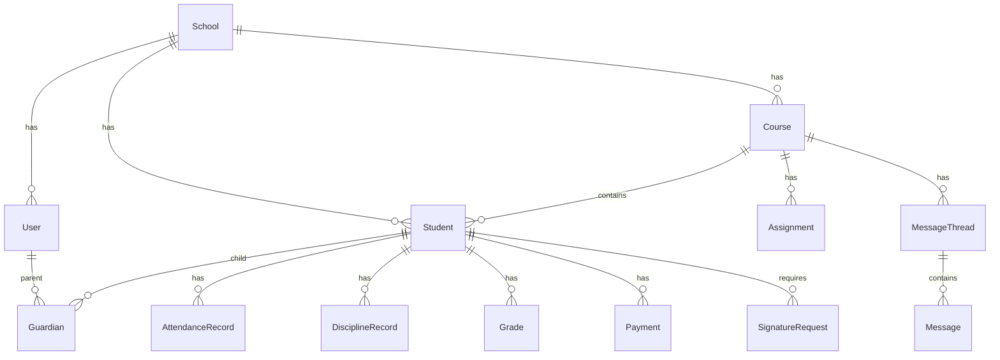

# Models — Dominio y DTOs

> Modelos derivados de `Userstories.md`. Convenciones: IDs UUID v4, fechas ISO 8601 UTC, montos en centavos (BOB).

---

## 1. Enumeraciones

```typescript
enum UserRole {
  ADMIN = 'admin',
  DIRECTOR = 'director',
  TEACHER = 'teacher',
  STUDENT = 'student',
  PARENT = 'parent',
}

enum SubmissionStatus {
  PENDING = 'pendiente',
  SUBMITTED = 'entregada',
  LATE = 'entregada_tarde',
  GRADED = 'calificada',
  RETURNED = 'devuelta',
}

enum AssignmentStatus {
  DRAFT = 'borrador',
  PUBLISHED = 'publicada',
  CLOSED = 'cerrada',
}

enum AttendanceStatus {
  PRESENT = 'presente',
  LATE = 'tarde',
  ABSENT = 'ausente',
}

enum DisciplineType {
  INCIDENT = 'incidente',
  COMPLIMENT = 'felicitacion',
}

enum DisciplineSeverity {
  LOW = 'leve',
  MEDIUM = 'media',
  HIGH = 'grave',
}

enum AnnouncementAudience {
  WHOLE_SCHOOL = 'todo_el_colegio',
  TEACHERS = 'docentes',
  PARENTS = 'padres',
  COURSE = 'curso',
}

enum CalendarEventType {
  EXAM = 'examen',
  ACTIVITY = 'actividad',
  MEETING = 'reunion',
  HOLIDAY = 'feriado',
}

enum PaymentStatus {
  PENDING = 'pendiente',
  PAID = 'pagado',
  OVERDUE = 'vencido',
  CANCELLED = 'cancelado',
}

enum SignatureStatus {
  PENDING = 'pendiente',
  SIGNED = 'firmado',
  REJECTED = 'rechazado',
}

enum SignatureDocumentType {
  EXCURSION = 'autorizacion_excursion',
  DISCIPLINE_ACK = 'acuse_disciplina',
  CUSTOM = 'personalizado',
}

enum AuthProvider {
  LOCAL = 'local',
  GOOGLE = 'google',
}

enum OAuthProvider {
  GOOGLE = 'google',
  // Futuro: MICROSOFT = 'microsoft', APPLE = 'apple'
}
```

---

## 2. Entidades de dominio

### 2.1 School (Colegio / Tenant)

| Campo | Tipo | Descripción |
|-------|------|-------------|
| id | UUID | PK |
| slug | string | Identificador URL (`san-miguel`) |
| name | string | Nombre oficial |
| timezone | string | ej. `America/La_Paz` |
| entry_time | time | Hora límite entrada (US-001) |
| logo_url | string? | Logo del colegio |
| settings | JSONB | Configuración (notificaciones, moneda) |
| created_at | datetime | |
| updated_at | datetime | |

---

### 2.2 User

| Campo | Tipo | Descripción |
|-------|------|-------------|
| id | UUID | PK |
| school_id | UUID | FK → School |
| email | string | Unique por school |
| password_hash | string? | NULL si solo Google OAuth |
| auth_provider | AuthProvider | `local` \| `google` |
| first_name | string | |
| last_name | string | |
| role | UserRole | admin, director, teacher, student, parent |
| phone | string? | No expuesto en chat |
| fcm_token | string? | Push notifications |
| student_id | UUID? | FK → Student (solo rol student) |
| email_verified | boolean | true tras OAuth Google verificado |
| last_login_at | datetime? | |
| is_active | boolean | |
| created_at | datetime | |

**Relaciones:**
- Teacher → Course (M:N via course_teachers)
- Parent → Student (M:N via guardians)
- Student user → Student entity (1:1 via student_id)
- User → UserOAuthIdentity (1:N proveedores)

---

### 2.2b UserOAuthIdentity (Google)

| Campo | Tipo | Descripción |
|-------|------|-------------|
| id | UUID | PK |
| user_id | UUID | FK → User |
| provider | OAuthProvider | `google` |
| provider_sub | string | Google `sub` (único global) |
| provider_email | string? | Email devuelto por Google |
| avatar_url | string? | Foto de perfil Google |
| linked_at | datetime | |

---

### 2.3 Student (Alumno)

| Campo | Tipo | Descripción |
|-------|------|-------------|
| id | UUID | PK |
| school_id | UUID | FK |
| first_name | string | |
| last_name | string | |
| enrollment_code | string | Código matrícula |
| course_id | UUID | FK → Course |
| is_active | boolean | |
| created_at | datetime | |

---

### 2.4 Guardian (Vinculación padre-alumno) — US-021

| Campo | Tipo | Descripción |
|-------|------|-------------|
| id | UUID | PK |
| parent_id | UUID | FK → User (role=parent) |
| student_id | UUID | FK → Student |
| relationship | GuardianRelationship | |
| is_primary | boolean | Contacto principal |
| created_at | datetime | |

---

### 2.5 Course (Curso / Aula)

| Campo | Tipo | Descripción |
|-------|------|-------------|
| id | UUID | PK |
| school_id | UUID | FK |
| name | string | ej. `3ro A` |
| grade_level | string | ej. `3` |
| section | string | ej. `A` |
| school_year | string | ej. `2026` |
| created_at | datetime | |

---

### 2.6 CourseTeacher

| Campo | Tipo | Descripción |
|-------|------|-------------|
| course_id | UUID | FK |
| teacher_id | UUID | FK → User |
| subject | string? | Materia principal |

---

### 2.7 AttendanceRecord — US-001, US-002, US-014

| Campo | Tipo | Descripción |
|-------|------|-------------|
| id | UUID | PK |
| student_id | UUID | FK |
| course_id | UUID | FK |
| recorded_by | UUID | FK → User (teacher) |
| date | date | Día del registro |
| check_in_at | datetime? | Hora entrada |
| check_out_at | datetime? | Hora salida (US-014) |
| status | AttendanceStatus | presente/tarde/ausente |
| notes | string? | |
| created_at | datetime | |

**Regla de negocio:** Si `check_in_at` > `school.entry_time` → status = `tarde`.

---

### 2.8 Assignment — US-003 (Moodle)

| Campo | Tipo | Descripción |
|-------|------|-------------|
| id | UUID | PK |
| course_id | UUID | FK |
| teacher_id | UUID | FK |
| subject | string | Materia (ej. Matemáticas) |
| title | string | |
| instructions | text | Instrucciones detalladas |
| due_at | datetime | Fecha límite con hora |
| attachments | JSONB | Material del profesor |
| allow_resubmit | boolean | Permitir reenvíos |
| max_score | decimal | Puntaje máximo (default 100) |
| status | AssignmentStatus | borrador / publicada / cerrada |
| created_at | datetime | |

---

### 2.8b AssignmentSubmission — US-025, US-026, US-027

| Campo | Tipo | Descripción |
|-------|------|-------------|
| id | UUID | PK |
| assignment_id | UUID | FK |
| student_id | UUID | FK |
| status | SubmissionStatus | pendiente → entregada → calificada |
| content_text | text? | Entrega en texto |
| attachments | JSONB | Archivos entregados |
| submitted_at | datetime? | |
| score | decimal? | Nota asignada |
| feedback | text? | Retroalimentación del profesor |
| graded_by | UUID? | FK → User (teacher) |
| graded_at | datetime? | |
| version | integer | Versión (reenvíos) |
| created_at | datetime | |

**Reglas:**
- `submitted_at > assignment.due_at` → status = `entregada_tarde`
- Solo rol `student` puede crear submission
- Padre solo lectura vía dashboard

---

### 2.8c ParentDashboard — US-029

DTO agregado (no tabla):

```typescript
interface ParentDashboard {
  student_id: UUID;
  attendance_summary: { presente: number; tarde: number; ausente: number };
  assignments_summary: { pendientes: number; entregadas: number; calificadas: number };
  grades_average: number | null;
  discipline_summary: { incidentes: number; felicitaciones: number };
}
```

---

### 2.8d SchoolModule — US-022

| Campo | Tipo | Descripción |
|-------|------|-------------|
| school_id | UUID | FK |
| module_code | string | assignments, payments, chat, etc. |
| is_enabled | boolean | |
| updated_at | datetime | |

---

### 2.8e TeacherReport — US-024

DTO agregado para director:

```typescript
interface TeacherReport {
  teacher_id: UUID;
  period: { from: date; to: date };
  assignments_published: number;
  submissions_received: number;
  submissions_graded: number;
  submissions_pending: number;
  attendance_days_complete: number;
  attendance_days_incomplete: number;
}
```

---

### 2.9 DisciplineRecord — US-005, US-006

| Campo | Tipo | Descripción |
|-------|------|-------------|
| id | UUID | PK |
| student_id | UUID | FK |
| teacher_id | UUID | FK |
| type | DisciplineType | incidente / felicitacion |
| severity | DisciplineSeverity? | Solo incidentes |
| description | text | |
| signature_status | SignatureStatus? | US-019 acuse |
| created_at | datetime | |

---

### 2.10 Announcement — US-007, US-008

| Campo | Tipo | Descripción |
|-------|------|-------------|
| id | UUID | PK |
| school_id | UUID | FK |
| author_id | UUID | FK → User |
| title | string | |
| body | text | |
| audience | AnnouncementAudience | |
| course_id | UUID? | Si audience = curso |
| published_at | datetime | |
| created_at | datetime | |

### AnnouncementRead

| Campo | Tipo | Descripción |
|-------|------|-------------|
| announcement_id | UUID | FK |
| user_id | UUID | FK |
| read_at | datetime | |

---

### 2.11 CalendarEvent — US-009

| Campo | Tipo | Descripción |
|-------|------|-------------|
| id | UUID | PK |
| school_id | UUID | FK |
| course_id | UUID? | Null = evento general |
| type | CalendarEventType | |
| title | string | |
| description | text? | |
| starts_at | datetime | |
| ends_at | datetime? | |
| reminder_sent | boolean | |
| created_by | UUID | FK |
| created_at | datetime | |

---

### 2.12 MessageThread — US-010, US-011

| Campo | Tipo | Descripción |
|-------|------|-------------|
| id | UUID | PK |
| school_id | UUID | FK |
| course_id | UUID | FK |
| parent_id | UUID | FK → User |
| teacher_id | UUID | FK → User |
| created_at | datetime | |

### Message

| Campo | Tipo | Descripción |
|-------|------|-------------|
| id | UUID | PK |
| thread_id | UUID | FK |
| sender_id | UUID | FK → User |
| body | text | |
| sent_at | datetime | |
| read_at | datetime? | |

---

### 2.13 Payment — US-012

| Campo | Tipo | Descripción |
|-------|------|-------------|
| id | UUID | PK |
| student_id | UUID | FK |
| reference | string | `PAY-2026-06-JP001` |
| concept | string | ej. `Pensión Junio 2026` |
| amount_cents | integer | Monto en centavos BOB |
| due_date | date | |
| status | PaymentStatus | |
| qr_payload | string? | Datos QR |
| paid_at | datetime? | |
| confirmed_by | UUID? | FK tesorero |
| created_at | datetime | |

---

### 2.14 Grade — US-013

| Campo | Tipo | Descripción |
|-------|------|-------------|
| id | UUID | PK |
| student_id | UUID | FK |
| course_id | UUID | FK |
| subject | string | |
| period | string | ej. `Parcial 1` |
| score | decimal | 0–100 |
| published_at | datetime | |
| teacher_id | UUID | FK |

---

### 2.15 GalleryAlbum — US-015

| Campo | Tipo | Descripción |
|-------|------|-------------|
| id | UUID | PK |
| course_id | UUID | FK |
| title | string | |
| description | text? | |
| created_by | UUID | FK |
| created_at | datetime | |

### GalleryPhoto

| Campo | Tipo | Descripción |
|-------|------|-------------|
| id | UUID | PK |
| album_id | UUID | FK |
| url | string | |
| caption | string? | |
| uploaded_at | datetime | |

---

### 2.16 DirectoryContact — US-016

| Campo | Tipo | Descripción |
|-------|------|-------------|
| id | UUID | PK |
| school_id | UUID | FK |
| category | string | enfermería, psicopedagogía, emergencia |
| name | string | |
| phone | string | |
| schedule | string? | |
| sort_order | integer | |

---

### 2.17 Poll — US-017

| Campo | Tipo | Descripción |
|-------|------|-------------|
| id | UUID | PK |
| school_id | UUID | FK |
| title | string | |
| description | text? | |
| options | JSONB | `[{id, label}]` |
| starts_at | datetime | |
| ends_at | datetime | |
| is_public_results | boolean | |
| created_by | UUID | FK |

### PollVote

| Campo | Tipo | Descripción |
|-------|------|-------------|
| poll_id | UUID | FK |
| user_id | UUID | FK |
| option_id | string | |
| voted_at | datetime | |

**Unique:** `(poll_id, user_id)` — un voto por usuario.

---

### 2.18 SignatureRequest — US-018, US-019

| Campo | Tipo | Descripción |
|-------|------|-------------|
| id | UUID | PK |
| school_id | UUID | FK |
| student_id | UUID | FK |
| parent_id | UUID | FK |
| document_type | SignatureDocumentType | |
| title | string | |
| body | text | Contenido del documento |
| related_id | UUID? | FK opcional (discipline_id) |
| status | SignatureStatus | |
| signature_image_url | string? | PNG del canvas |
| signed_at | datetime? | |
| rejected_reason | string? | |
| device_info | JSONB? | IP, user-agent |
| created_by | UUID | FK |
| created_at | datetime | |

---

### 2.19 AuditLog — US-011

| Campo | Tipo | Descripción |
|-------|------|-------------|
| id | UUID | PK |
| school_id | UUID | FK |
| actor_id | UUID | FK → User |
| action | string | ej. `message.audit.view` |
| resource_type | string | |
| resource_id | UUID | |
| reason | string? | Motivo obligatorio en auditoría |
| metadata | JSONB? | |
| created_at | datetime | |

---

## 3. DTOs de API (request/response)

### AuthLoginRequest (US-020)

```json
{
  "email": "carlos@email.com",
  "password": "********",
  "school_slug": "san-miguel"
}
```

### AuthLoginResponse

```json
{
  "access_token": "eyJ...",
  "refresh_token": "eyJ...",
  "expires_in": 900,
  "user": {
    "id": "uuid",
    "role": "parent",
    "first_name": "Carlos",
    "last_name": "Pérez",
    "school_id": "uuid"
  }
}
```

### CreateAttendanceRequest (US-001)

```json
{
  "student_id": "uuid",
  "status": "presente",
  "check_in_at": "2026-06-19T07:55:00-04:00"
}
```

### AttendanceSummaryResponse (US-002)

```json
{
  "student_id": "uuid",
  "period": { "from": "2026-06-01", "to": "2026-06-30" },
  "summary": {
    "presente": 18,
    "tarde": 2,
    "ausente": 1
  },
  "records": [
    {
      "date": "2026-06-10",
      "status": "tarde",
      "check_in_at": "2026-06-10T08:15:00-04:00"
    }
  ]
}
```

### CreateAssignmentRequest (US-003)

```json
{
  "title": "Ejercicios de fracciones",
  "description": "Completar página 45-46",
  "due_date": "2026-06-25",
  "attachment_ids": ["uuid-file-1"]
}
```

### SignDocumentRequest (US-018)

```json
{
  "signature_image_base64": "data:image/png;base64,iVBOR...",
  "action": "sign"
}
```

### RejectSignatureRequest

```json
{
  "action": "reject",
  "reason": "Conflicto de horario"
}
```

### ErrorResponse (estándar)

```json
{
  "error": {
    "code": "VALIDATION_ERROR",
    "message": "La fecha de entrega es obligatoria",
    "details": [{ "field": "due_date", "message": "required" }]
  }
}
```

---

## 4. Diagrama de relaciones (ER simplificado)



---

## 5. Eventos de dominio (para notification worker)

| Evento | Payload clave | Destinatarios |
|--------|---------------|---------------|
| `AttendanceRecorded` | student_id, status, time | Padres vinculados |
| `AssignmentCreated` | course_id, title, due_date | Padres del curso |
| `DisciplineRecorded` | student_id, type | Padres vinculados |
| `AnnouncementPublished` | audience, course_id? | Según audiencia |
| `GradePublished` | student_id, subject, score | Padres vinculados |
| `PaymentReminderSent` | student_id, amount, reference | Padres vinculados |
| `CheckoutRecorded` | student_id, time | Padres vinculados |
| `MessageReceived` | thread_id, sender_id | Destinatario del chat |
| `SignatureRequested` | parent_id, title | Padre asignado |
| `SignatureCompleted` | teacher_id, status | Docente creador |
