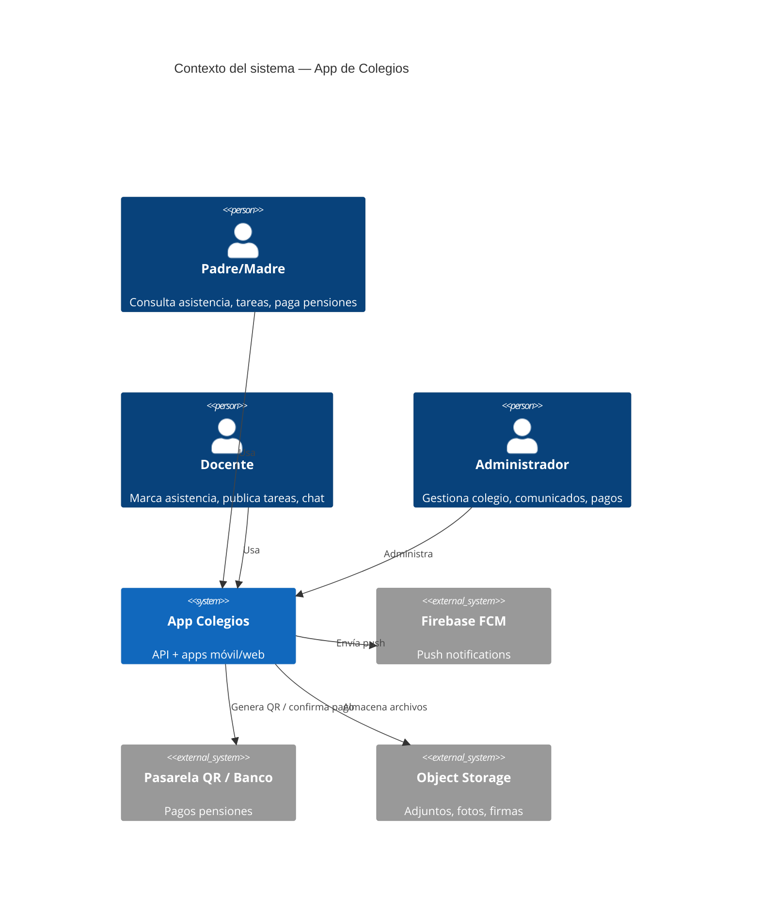
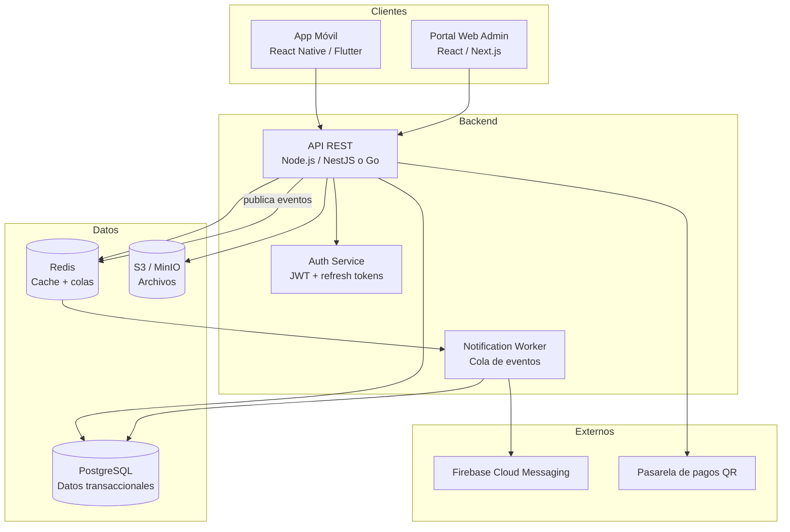

# Architecture — Aplicación de Colegios

## 1. Visión del producto

App **mobile-first** de comunicación escuela–familia para colegios en El Alto y Latinoamérica. Prioriza el **uso diario** (asistencia, tareas, chat, comunicados) sobre un ERP completo. Se inspira en plataformas como Phidias, MyEncore y QuickSchools, pero con alcance acotado y costo operativo bajo (modelo SaaS por alumno).

### Diferenciadores vs. competencia

| Aspecto | Competidores típicos | Nuestra app |
|---------|---------------------|-------------|
| Enfoque | ERP/SIS completo | Comunicación y seguimiento diario |
| Chat | Email/SMS o portal | Chat in-app sin exponer teléfonos |
| Firma | Papel o módulos enterprise | Firma digital simple en pantalla |
| Precio | $1–15 USD/alumno/mes | Objetivo: plan accesible por volumen |
| Región | Global / genérico | Adaptado a El Alto (BOB, normativa local) |

---

## 2. Principios arquitectónicos

1. **Spec-Driven Development (SDD):** Las user stories en Gherkin son la fuente de verdad; API, modelos y tests se derivan de `Userstories.md`.
2. **Multi-tenant por colegio:** Cada institución es un tenant aislado (`school_id` en todas las entidades).
3. **API-first:** Cliente móvil (React Native / Flutter) y portal web admin consumen la misma REST API (`Openapi.yml`).
4. **Event-driven para notificaciones:** Cambios de asistencia, tareas, pagos, etc. publican eventos que un worker de notificaciones procesa (push, email opcional).
5. **Seguridad por rol (RBAC):** Padre solo ve sus hijos; docente solo sus cursos; admin ve todo el tenant.
6. **Offline-tolerant (fase 2):** Marcado de asistencia con sync diferido en zonas de conectividad limitada.

---

## 3. Diagrama de contexto (C4 — Nivel 1)



---

## 4. Diagrama de contenedores (C4 — Nivel 2)



---

## 5. Stack tecnológico recomendado

| Capa | Tecnología | Justificación |
|------|------------|---------------|
| API | **NestJS + TypeScript** | OpenAPI nativo, módulos por dominio, ecosistema maduro |
| Base de datos | **PostgreSQL 16** | Relacional, JSONB para metadatos, RLS para multi-tenant |
| Cache/Colas | **Redis + BullMQ** | Notificaciones async, rate limiting |
| Storage | **MinIO / AWS S3** | Adjuntos, galería, imágenes de firma |
| Auth | **JWT + refresh token** | Stateless, compatible con móvil |
| Push | **Firebase FCM** | Estándar Android/iOS |
| Móvil | **Flutter** | Un codebase, buen rendimiento offline futuro |
| Web admin | **Next.js** | SSR, dashboard administrativo |
| Infra | **Docker + VPS / Railway** | Costo bajo para MVP; migrar a K8s si escala |

---

## 6. Módulos de dominio (bounded contexts)

```
src/
├── auth/           # US-020: login, tokens, roles
├── schools/        # Multi-tenant, configuración colegio
├── users/          # Padres, docentes, admins
├── students/       # Alumnos, vinculación padre-alumno (US-021)
├── attendance/     # US-001, US-002, US-014
├── assignments/    # US-003, US-004
├── discipline/     # US-005, US-006
├── announcements/  # US-007, US-008
├── calendar/       # US-009
├── messaging/      # US-010, US-011
├── payments/       # US-012
├── grades/         # US-013
├── galleries/      # US-015
├── directory/      # US-016
├── polls/          # US-017
├── signatures/     # US-018, US-019
└── notifications/  # Worker transversal
```

Cada módulo expone:
- Controller (REST)
- Service (lógica de negocio)
- Repository (acceso a DB)
- DTOs alineados con `Openapi.yml`

---

## 7. Modelo de despliegue (MVP)

```
                    ┌─────────────────┐
                    │  CDN / Nginx    │
                    └────────┬────────┘
                             │
              ┌──────────────┼──────────────┐
              │              │              │
        ┌─────▼─────┐  ┌─────▼─────┐  ┌─────▼─────┐
        │ API x2    │  │ Worker x1 │  │ PostgreSQL│
        │ (stateless│  │           │  │ + Redis   │
        └───────────┘  └───────────┘  └───────────┘
```

- **Entorno dev:** Docker Compose local (API + PG + Redis + MinIO).
- **Entorno prod:** 1 VPS (4 vCPU, 8 GB RAM) soporta ~2.000 alumnos activos en MVP.
- **Escalado horizontal:** API stateless detrás de load balancer cuando >5 colegios grandes.

---

## 8. Seguridad

| Control | Implementación |
|---------|----------------|
| Autenticación | JWT (15 min) + refresh token (7 días) en httpOnly cookie (web) o secure storage (móvil) |
| Autorización | RBAC: `admin`, `teacher`, `parent`, `treasurer` |
| Multi-tenant | Middleware inyecta `school_id` desde token; queries filtradas |
| Datos sensibles | Contraseñas bcrypt; firmas e IPs en tabla audit |
| Chat | Sin PII de teléfono; logs auditables solo por admin con motivo |
| Archivos | URLs firmadas temporales (presigned S3) |
| API | Rate limit 100 req/min por usuario; HTTPS obligatorio |

---

## 9. Integraciones externas

### 9.1 Notificaciones push (FCM)

Eventos que disparan push:
- Entrada / tarde / ausencia / salida
- Nueva tarea, comunicado, calificación
- Mensaje de chat
- Recordatorio de pago
- Solicitud de firma pendiente

### 9.2 Pagos QR (fase Should)

- Generación de QR con referencia única (`PAY-{year}-{month}-{studentRef}`)
- Integración inicial: QR estático con datos bancarios + referencia (sin pasarela)
- Fase 2: API bancaria o wallet local (evaluar normativa Bolivia)

### 9.3 Almacenamiento de archivos

- Tareas: PDF, imágenes (max 10 MB)
- Galería: imágenes (max 5 MB c/u)
- Firmas: PNG desde canvas (max 500 KB)

---

## 10. Flujos críticos

### 10.1 Asistencia con notificación

```
Docente → POST /attendance → Validar curso/alumno
  → Persistir registro → Publicar evento AttendanceRecorded
  → Worker → FCM → Padre recibe push
```

### 10.2 Firma digital

```
Admin/Docente → POST /signatures/requests → Padre recibe push
  → Padre dibuja firma → POST /signatures/{id}/sign
  → Guardar imagen + audit → Notificar docente
```

### 10.3 Chat seguro

```
Padre → POST /messages (validar relación curso)
  → Persistir mensaje → WebSocket/polling → Docente
  → Sin exponer teléfono; thread_id por par padre-docente-curso
```

---

## 11. Roadmap por fases

| Fase | Alcance | User Stories |
|------|---------|--------------|
| **MVP** | Auth, asistencia, tareas, disciplina, comunicados, chat, firma | US-001–011, US-018–021 |
| **v1.1** | Calendario, calificaciones, salida segura | US-009, US-013, US-014 |
| **v1.2** | Pagos QR, galería, directorio | US-012, US-015, US-016 |
| **v1.3** | Encuestas, offline sync, reportes admin | US-017 + mejoras |

---

## 12. Decisiones arquitectónicas (ADRs resumidos)

| ID | Decisión | Alternativa descartada | Razón |
|----|----------|------------------------|-------|
| ADR-001 | PostgreSQL monolito modular | Microservicios | MVP más simple, un equipo |
| ADR-002 | REST + OpenAPI | GraphQL | Clientes móviles, cache CDN, spec clara |
| ADR-003 | Eventos async para notificaciones | Sync en request | Latencia baja en API; FCM puede fallar |
| ADR-004 | Multi-tenant lógico (school_id) | DB por colegio | Costo operativo menor hasta >50 colegios |
| ADR-005 | Gherkin en specs, no en repo de tests aún | Cucumber desde día 1 | Specs primero; tests E2E en fase MVP |

---

## 13. Referencias

- Especificaciones: `Userstories.md`, `Models.md`, `Database.md`, `Openapi.yml`
- Competencia analizada: MyEncore, QuickSchools, Classter, Phidias, DocCF, Clickschool, iSAMS
- Metodología: BDD (Gherkin) + SDD (specs como contrato)
