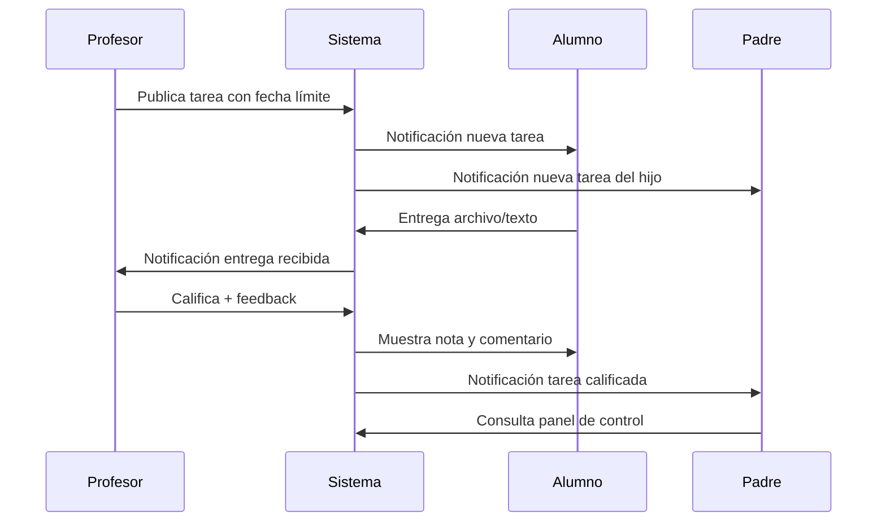

> **Producto:** Ver [`docs/01-overview.md`](../docs/01-overview.md) y [`docs/user-stories/`](../docs/user-stories/README.md).

> Las user stories están en **`docs/user-stories/`** (un archivo por US). Este archivo es índice legacy.

---

## Índice → docs/user-stories/

Ver [docs/user-stories/README.md](../docs/user-stories/README.md) para la lista completa.

**MVP:** US-001–006, US-020–029 · **Ingeniería:** US-T01, US-T02

---

## Contenido legacy (consolidado abajo)

| Nivel | Rol | Plataforma principal | Responsabilidades |
|-------|-----|---------------------|-------------------|
| 1 | **Administrador** | Web | Gestiona usuarios, roles, módulos y configuración del colegio |
| 2 | **Director** | Web | Administra profesores, supervisa reportes académicos y de desempeño docente |
| 3 | **Profesor** | Web + Móvil | Asigna tareas (Moodle), controla alumnos (asistencia, disciplina, calificaciones) |
| 4 | **Alumno / Padre de familia** | Móvil + Web | Alumno: recibe y entrega tareas. Padre: monitorea el progreso y control de su hijo |

> **Nota técnica:** Alumno y padre son dos roles distintos (`student`, `parent`) dentro del mismo nivel de consumo. El padre **no entrega tareas**, pero **ve el estado** de las tareas de su hijo.

### Matriz de permisos por rol

| Módulo | Admin | Director | Profesor | Alumno | Padre |
|--------|:-----:|:--------:|:--------:|:------:|:-----:|
| Gestión usuarios | ✓ | — | — | — | — |
| Gestión profesores | ✓ | ✓ | — | — | — |
| Reportes docentes | ✓ | ✓ | — | — | — |
| Asignar/calificar tareas | ✓ | — | ✓ | — | — |
| Entregar tareas | — | — | — | ✓ | — |
| Ver tareas (propio/hijo) | — | — | ✓ | ✓ | ✓ |
| Control asistencia | ✓ | ver | ✓ | ver propio | ver hijo |
| Disciplina | ✓ | ver | ✓ | ver propio | ver hijo |
| Comunicados | ✓ | ✓ | ✓ | ✓ | ✓ |
| Configurar módulos | ✓ | — | — | — | — |

---

## Épicas

| ID | Épica | Prioridad |
|----|-------|-----------|
| E0 | Roles, usuarios y autenticación | Must |
| E1 | Asistencia y puntualidad | Must |
| **E2** | **Tareas estilo Moodle (LMS)** | **Must** |
| **E-P** | **Panel de control parental** | **Must** |
| **E-D** | **Gestión docente y reportes (Director)** | **Must** |
| E3 | Cuaderno de disciplina | Must |
| E4 | Comunicados y circulares | Should |
| E5 | Calendario escolar | Should |
| E6 | Mensajería directa (chat seguro) | Should |
| E7 | Control de pagos | Could |
| E8 | Boletín de calificaciones | Should |
| E9 | Salida segura | Should |
| E10 | Galería de actividades | Could |
| E11 | Directorio escolar | Could |
| E12 | Encuestas y votaciones | Could |
| E13 | Firma digital (El Alto) | Should |

---

## E0 — Roles, Usuarios y Autenticación

### US-020: Inicio de sesión por rol (web y móvil)

**Como** usuario del colegio (admin, director, profesor, alumno o padre)  
**Quiero** iniciar sesión desde web o app móvil  
**Para que** acceda solo a las funciones de mi rol

**Prioridad:** Must | **Épica:** E0

```gherkin
Feature: Autenticación multi-rol web y móvil
  Como usuario del colegio
  Quiero autenticarme con email y contraseña
  Para acceder según mi rol en web o móvil

  Scenario: Login exitoso de padre en móvil
    Given el padre tiene cuenta activa en colegio "San Miguel"
    When inicia sesión desde la app móvil con credenciales válidas
    Then recibe token JWT con rol "parent"
    And ve el panel de control de sus hijos

  Scenario: Login exitoso de profesor en web
    When el profesor inicia sesión desde el portal web
    Then accede al módulo de tareas estilo Moodle de sus cursos

  Scenario: Login exitoso de director
    When el director inicia sesión
    Then accede al dashboard de reportes de profesores
    And no puede gestionar módulos del sistema

  Scenario: Alumno no accede a panel de administración
    Given un alumno autenticado
    When intenta acceder a "/admin/users"
    Then recibe error 403 "Acceso denegado"

  Scenario: Credenciales inválidas
    When inicia sesión con contraseña incorrecta
    Then recibe error 401 "Credenciales inválidas"
```

---

### US-021: Vincular padre con alumno

**Como** administrador  
**Quiero** vincular cuentas de padres con alumnos  
**Para que** cada padre monitoree únicamente a sus hijos

**Prioridad:** Must | **Épica:** E0

```gherkin
Feature: Vinculación padre-alumno
  Como administrador
  Quiero vincular padres con alumnos
  Para controlar el acceso familiar al panel de control

  Scenario: Vincular padre existente
    When vincula padre "Carlos Pérez" con alumno "Juan Pérez" relación "padre"
    Then el padre ve en su panel: tareas, asistencia y calificaciones de Juan
    And no puede ver datos de otros alumnos
```

---

### US-022: Administrador gestiona usuarios y módulos

**Como** administrador  
**Quiero** crear, editar y desactivar usuarios de todos los roles  
**Para que** controle quién accede al sistema y qué módulos están activos

**Prioridad:** Must | **Épica:** E0

```gherkin
Feature: Gestión de usuarios por administrador
  Como administrador
  Quiero gestionar usuarios y módulos del colegio
  Para administrar el acceso al sistema

  Scenario: Crear cuenta de profesor
    When crea usuario con rol "teacher" email "maria.lopez@colegio.edu"
    Then el profesor puede iniciar sesión y ver sus cursos asignados

  Scenario: Crear cuenta de alumno vinculada a matrícula
    When crea usuario rol "student" vinculado al alumno "Juan Pérez"
    Then el alumno puede ver y entregar tareas de su curso

  Scenario: Desactivar módulo de pagos
    When desactiva el módulo "payments" para el colegio
    Then ningún usuario ve el menú de pagos
    And los endpoints de pagos retornan 403
```

---

### US-023: Director gestiona profesores

**Como** director  
**Quiero** asignar profesores a cursos y materias  
**Para que** cada docente administre solo sus alumnos asignados

**Prioridad:** Must | **Épica:** E-D

```gherkin
Feature: Gestión de profesores por director
  Como director
  Quiero asignar profesores a cursos y materias
  Para organizar la carga académica

  Scenario: Asignar profesor a curso y materia
    When asigna profesor "María López" al curso "3ro A" materia "Matemáticas"
    Then la profesora puede publicar tareas de Matemáticas en "3ro A"
    And aparece en el listado de profesores del director

  Scenario: Director no puede crear administradores
    When intenta crear usuario con rol "admin"
    Then recibe error 403 "Solo el administrador puede crear este rol"
```

---

### US-024: Director consulta reportes de profesores

**Como** director  
**Quiero** ver reportes de actividad y desempeño de los profesores  
**Para que** supervise el cumplimiento docente

**Prioridad:** Must | **Épica:** E-D

```gherkin
Feature: Reportes de profesores para director
  Como director
  Quiero ver reportes de los profesores
  Para supervisar tareas asignadas, calificaciones y asistencia registrada

  Scenario: Reporte de tareas por profesor
    Given el profesor "María López" publicó 5 tareas este mes
    And calificó 3 de 5 entregas
    When el director consulta reporte de "María López" periodo "Junio 2026"
    Then ve: tareas publicadas, entregas recibidas, entregas calificadas, pendientes

  Scenario: Reporte de asistencia registrada por profesor
    When el director consulta reporte de asistencia del profesor "María López"
    Then ve días conveedor con registro completo vs. incompleto del curso

  Scenario: Exportar reporte a PDF
    When solicita exportar reporte del profesor "María López"
    Then descarga PDF con resumen del periodo
```

---

## E2 — Tareas estilo Moodle (LMS)

> Inspirado en Moodle: el profesor **publica actividades/tareas**, el alumno **entrega**, el profesor **califica y da feedback**, el padre **monitorea el estado**.

### US-003: Profesor publica tarea (actividad Moodle)

**Como** profesor  
**Quiero** crear una tarea con instrucciones, adjuntos y fecha límite  
**Para que** los alumnos sepan qué entregar y cuándo

**Prioridad:** Must | **Épica:** E2

```gherkin
Feature: Publicación de tarea estilo Moodle
  Como profesor
  Quiero crear tareas con instrucciones, adjuntos y fecha límite
  Para que los alumnos las reciban en su aula virtual

  Background:
    Given el profesor "María López" está autenticada
    And imparte "Matemáticas" en curso "3ro A"

  Scenario: Crear tarea con adjunto e instrucciones
    When publica tarea "Ejercicios de fracciones" materia "Matemáticas"
    And establece fecha límite "2026-06-25 23:59"
    And adjunta "hoja_ejercicios.pdf"
    And escribe instrucciones "Resolver ejercicios 1 al 10"
    Then la tarea aparece en el aula virtual de "3ro A"
    And los alumnos y padres del curso reciben notificación

  Scenario: Fecha límite obligatoria
    When intenta publicar tarea sin fecha límite
    Then el sistema muestra error "La fecha límite es obligatoria"
```

---

### US-025: Alumno entrega tarea (submission Moodle)

**Como** alumno  
**Quiero** subir mi entrega de tarea antes o después de la fecha límite  
**Para que** el profesor pueda revisarla y calificarla

**Prioridad:** Must | **Épica:** E2

```gherkin
Feature: Entrega de tarea por alumno
  Como alumno
  Quiero entregar mi tarea con archivos o texto
  Para cumplir con la actividad asignada

  Background:
    Given el alumno "Juan Pérez" está autenticado
    And existe tarea "Ejercicios de fracciones" con límite "2026-06-25 23:59"

  Scenario: Entrega a tiempo
    When entrega archivo "tarea_juan.pdf" antes de la fecha límite
    Then la entrega queda con estado "entregada"
    And el profesor recibe notificación de nueva entrega

  Scenario: Entrega tardía
    When entrega archivo "tarea_juan.pdf" el "2026-06-26 10:00"
    Then la entrega queda con estado "entregada_tarde"
    And el profesor ve indicador de entrega tardía

  Scenario: Re-entrega permitida
    Given el profesor configuró "permitir reenvíos" en la tarea
    When el alumno vuelve a subir "tarea_juan_v2.pdf"
    Then la versión anterior queda archivada
    And la entrega activa es la última versión
```

---

### US-026: Profesor califica entrega y da feedback

**Como** profesor  
**Quiero** calificar cada entrega y escribir retroalimentación  
**Para que** el alumno y su padre conozcan el resultado

**Prioridad:** Must | **Épica:** E2

```gherkin
Feature: Calificación y feedback estilo Moodle
  Como profesor
  Quiero calificar entregas y dar retroalimentación
  Para cerrar el ciclo de la tarea

  Scenario: Calificar entrega con nota y comentario
    Given el alumno "Juan Pérez" entregó "Ejercicios de fracciones"
    When el profesor asigna nota "85" y comentario "Buen trabajo, revisar ejercicio 7"
    Then la entrega queda estado "calificada"
    And el alumno ve nota y feedback en web y móvil
    And el padre de Juan recibe notificación "Tarea calificada: 85 pts"

  Scenario: Marcar entrega sin calificar aún
    Given 3 alumnos no han entregado
    When el profesor abre panel de entregas de la tarea
    Then ve lista: entregadas, tardías, pendientes, calificadas
```

---

### US-027: Profesor ve panel de entregas por tarea

**Como** profesor  
**Quiero** un panel con el estado de todas las entregas de una tarea  
**Para que** gestione calificaciones como en Moodle

**Prioridad:** Must | **Épica:** E2

```gherkin
Feature: Panel de entregas del profesor
  Como profesor
  Quiero ver el estado de entregas de cada tarea
  Para identificar alumnos pendientes rápidamente

  Scenario: Vista resumen de entregas
    Given la tarea "Ejercicios de fracciones" tiene 30 alumnos
    And 20 entregaron, 2 tardías, 8 pendientes, 15 calificadas
    When el profesor abre el panel de la tarea
    Then ve contadores: 20 entregadas, 2 tardías, 8 pendientes, 15 calificadas
    And puede filtrar por estado
```

---

### US-004: Padre monitorea tareas del hijo

**Como** padre/madre  
**Quiero** ver el estado de todas las tareas de mi hijo  
**Para que** pueda apoyarlo y hacer seguimiento sin entregar por él

**Prioridad:** Must | **Épica:** E2 / E-P

```gherkin
Feature: Monitoreo de tareas por padre
  Como padre
  Quiero ver el estado de las tareas de mi hijo
  Para apoyarlo en cumplir con sus deberes

  Scenario: Ver tareas con estado Moodle
    Given el hijo tiene 2 tareas pendientes, 1 entregada_tarde y 1 calificada
    When el padre abre "Tareas de Juan"
    Then ve cada tarea con estado: pendiente, entregada, entregada_tarde, calificada
    And ve la nota y feedback en tareas calificadas
    And no puede subir entregas en nombre del hijo

  Scenario: Notificación de tarea próxima a vencer
    Given una tarea vence en 24 horas y el hijo no ha entregado
    When el sistema ejecuta recordatorios
    Then el padre recibe push "Juan tiene tarea pendiente: Ejercicios de fracciones"
```

---

### US-028: Alumno consulta sus tareas y calificaciones

**Como** alumno  
**Quiero** ver mis tareas pendientes, entregadas y calificadas  
**Para que** sepa qué debo hacer y cómo me fue

**Prioridad:** Must | **Épica:** E2

```gherkin
Feature: Vista de tareas del alumno
  Como alumno
  Quiero ver mis tareas en web y móvil
  Para gestionar mis entregas

  Scenario: Listar tareas por estado
    When el alumno abre "Mis tareas"
    Then ve pestañas: pendientes, entregadas, calificadas
    And las pendientes muestran cuenta regresiva hasta fecha límite
```

---

## E-P — Panel de Control Parental

### US-029: Padre ve resumen integral del hijo

**Como** padre/madre  
**Quiero** un panel con resumen de asistencia, tareas, calificaciones y disciplina  
**Para que** controle el progreso de mi hijo en un solo lugar

**Prioridad:** Must | **Épica:** E-P

```gherkin
Feature: Panel de control parental
  Como padre
  Quiero un dashboard con el resumen de mi hijo
  Para monitorear su situación escolar

  Scenario: Dashboard del hijo
    Given el padre está vinculado a "Juan Pérez"
    When abre el panel de control
    Then ve:
      | sección       | resumen                          |
      | Asistencia    | 18 presentes, 2 tardanzas, 1 falta |
      | Tareas        | 2 pendientes, 1 calificada hoy     |
      | Calificaciones| Promedio parcial: 78               |
      | Disciplina    | 1 felicitación este mes            |
    And puede navegar al detalle de cada sección
```

---

## E1 — Asistencia y Puntualidad

### US-001: Profesor registra asistencia

**Como** profesor  
**Quiero** marcar la asistencia de mis alumnos  
**Para que** quede registro y el padre sea notificado

**Prioridad:** Must | **Épica:** E1

```gherkin
Feature: Registro de asistencia
  Como profesor
  Quiero marcar asistencia de mis alumnos
  Para notificar a los padres en tiempo real

  Scenario: Entrada a tiempo
    When marca entrada de "Juan Pérez" a las "07:55"
    Then el registro queda estado "presente"
    And el padre recibe push "Juan ingresó al colegio a las 07:55"

  Scenario: Entrada tardía
    When marca entrada de "Juan Pérez" a las "08:15"
    And el horario de entrada es "08:00"
    Then el registro queda estado "tarde"
    And el padre recibe push "Juan llegó tarde"
```

---

### US-002: Padre y alumno consultan asistencia

**Como** padre o alumno  
**Quiero** ver el historial de asistencia  
**Para que** haga seguimiento (padre de su hijo, alumno de sí mismo)

**Prioridad:** Must | **Épica:** E1

```gherkin
Feature: Consulta de asistencia
  Scenario: Padre ve historial del hijo
    When el padre consulta asistencia de "Juan Pérez" del mes actual
    Then ve resumen de presentes, tardanzas y ausencias

  Scenario: Alumno ve su propia asistencia
    When el alumno "Juan Pérez" consulta su asistencia
    Then ve solo sus propios registros
```

---

## E3 — Cuaderno de Disciplina

### US-005: Profesor registra llamada de atención

**Como** profesor  
**Quiero** registrar incidentes conductuales  
**Para que** el padre sea informado y quede historial

**Prioridad:** Must | **Épica:** E3

```gherkin
Feature: Registro de incidentes
  Scenario: Crear llamada de atención
    When registra incidente gravedad "media" para "Juan Pérez"
    Then el padre recibe notificación
    And aparece en panel de control del padre
```

---

### US-006: Profesor registra felicitación

**Como** profesor  
**Quiero** registrar felicitaciones  
**Para que** el padre vea refuerzo positivo

**Prioridad:** Must | **Épica:** E3

```gherkin
Feature: Felicitaciones
  Scenario: Registrar felicitación
    When registra felicitación para "Juan Pérez"
    Then aparece en cuaderno de disciplina como "felicitación"
    And el padre recibe notificación positiva
```

---

## E4 — Comunicados (resumen)

### US-007 / US-008: Comunicados masivos y lectura

**Como** director/admin (publicar) o padre/alumno/profesor (leer)  
**Prioridad:** Should

```gherkin
Feature: Comunicados escolares
  Scenario: Director publica circular a todo el colegio
    When publica "Suspensión por feriado" audiencia "todo_el_colegio"
    Then todos los roles reciben notificación

  Scenario: Marcar como leído
    When el padre abre el comunicado
    Then se marca como leído
```

---

## E8 — Calificaciones

### US-013: Profesor publica notas / Padre consulta boletín

**Prioridad:** Should | **Épica:** E8

```gherkin
Feature: Boletín de calificaciones
  Scenario: Padre consulta notas en panel de control
    When el padre abre calificaciones de su hijo periodo "Parcial 1"
    Then ve notas por materia y promedio
    And las notas de tareas Moodle se integran al promedio si está configurado
```

---

## E13 — Firma Digital (El Alto)

### US-018 / US-019: Firma de autorizaciones y acuses

**Prioridad:** Should | **Épica:** E13

*(Sin cambios funcionales — padre firma desde móvil o web)*

---

## Matriz de trazabilidad (User Story → API)

| User Story | Endpoints principales |
|------------|----------------------|
| US-020 | `POST /auth/login`, `POST /auth/google`, `POST /auth/refresh`, `POST /auth/logout`, `GET /auth/me`, `POST/DELETE /auth/link/google` |
| US-021 | `POST /students/{id}/guardians` |
| US-022 | `CRUD /admin/users`, `PATCH /admin/modules` |
| US-023 | `POST /director/teachers/assignments` |
| US-024 | `GET /director/reports/teachers/{id}` |
| US-003 | `POST /courses/{id}/assignments` |
| US-025 | `POST /assignments/{id}/submissions` |
| US-026 | `PATCH /submissions/{id}/grade` |
| US-027 | `GET /assignments/{id}/submissions` |
| US-004, US-028 | `GET /students/{id}/assignments` |
| US-029 | `GET /parents/dashboard/{studentId}` |
| US-001, US-002 | `POST/GET /attendance` |
| US-005, US-006 | `POST/GET /discipline` |
| US-007, US-008 | `POST/GET /announcements` |
| US-013 | `GET /students/{id}/grades` |
| US-018, US-019 | `POST/GET /signatures` |

---

## Flujo Moodle simplificado


